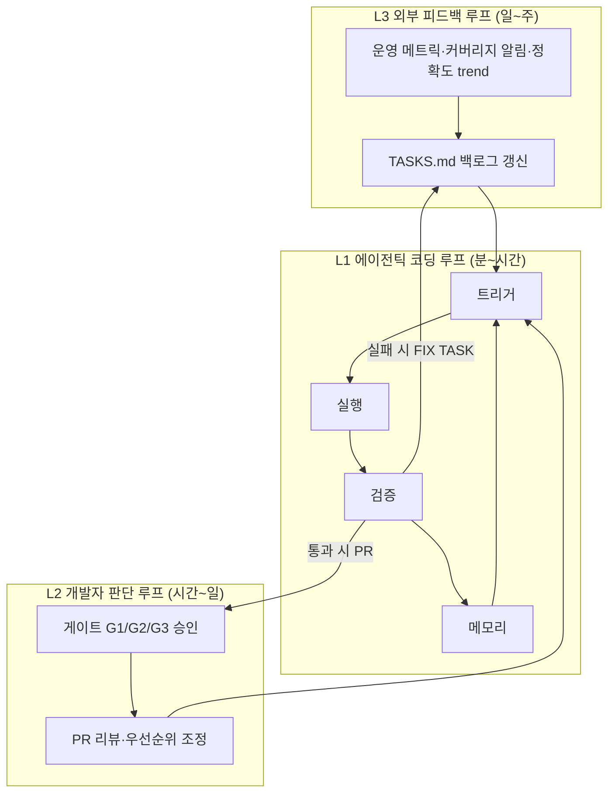

# Mail 프로젝트 자동개발 시스템 — 루프 엔지니어링 설계

> **상태:** 설계 + 1차 인프라 (`scripts/loop_runner.py`, `scripts/loop_verify.py`, `auto_dev/loop_config.json`)
> **목표:** 사람이 매번 에이전트에게 지시하지 않고, **에이전트를 돌리는 루프**를 설계해 TASK 큐·검증·PR까지 무인으로 이어지게 한다.
> **원칙:** 판단 기준은 재사용 가능한 **작업 자산(work assets)** 에 담고, 루프 전체가 최적화 단위가 된다.

---

## 1. 왜 루프 엔지니어링인가

| 단계 | 최적화 단위 | Mail 프로젝트 대응 |
|------|-------------|-------------------|
| 프롬프트 엔지니어링 | 한 번의 출력 | "이 버그 고쳐줘" 일회성 지시 |
| 컨텍스트 엔지니어링 | 한 세션의 맥락 | HANDOFF_PROMPT, AGENTS.md |
| 하네스 엔지니어링 | 실행 환경 | pytest, GHA, dry-run |
| **루프 엔지니어링** | **반복 시스템 전체** | TASK 큐 → 구현 → 게이트 → PR → 상태 갱신 |

Mail 프로젝트에는 이미 루프의 조각이 있다.

- **큐:** `TASKS.md`, `scripts/auto_dev_queue.py`, `.github/workflows/auto-dev-queue.yml`
- **안전 규칙:** `RULES.md`
- **검증 게이트:** `scripts/recall_zero_gate.py`, `scripts/core_sources_checklist.py`, `test_monitor.py`
- **정확도 루프(별도 트랙):** `docs/mail_accuracy_orchestrator_plan.md`

이 설계는 조각을 **하나의 루프 스택**으로 묶고, 사람 개입을 **명시적 게이트 3곳**으로 제한한다.

---

## 2. 세 겹의 루프 (속도별)

앤드류 응의 3단계 루프를 Mail 자동개발에 맞게 재해석한다.



### L1 — 에이전틱 코딩 루프 (빠름, 무인)

**주기:** GitHub Actions cron(매일) + `workflow_dispatch` + PR 이벤트 후속

| 단계 | 담당 | 산출물 |
|------|------|--------|
| 트리거 | `auto-dev-queue.yml`, `loop_config.json` | 다음 PENDING TASK 1건 |
| 실행 | Cursor Cloud Agent / `loop_runner.py` | 브랜치 + 커밋 |
| 검증 | `loop_verify.py` → recall/core/unit gates | `verify_report.json` |
| 메모리 | `auto_dev_state.json`, `done_tasks.md` | 재시도 횟수, 마지막 게이트 결과 |
| 종료 | 통과→PR / 실패→FAILED+FIX / 위험→BLOCKED | TASK 섹션 이동 |

**종료 조건 (명시적):**

- `verify.all_pass == true` → DONE 후보
- `retry_count >= max_retry` → BLOCKED
- 보호 파일·발송 위험 키워드 → BLOCKED
- `max_iterations` 초과 → FAILED + 사람 에스컬레이션
- 변경 없음 → SKIPPED

### L2 — 개발자 판단 루프 (중간, 최소 개입)

사람은 **버그를 하나씩 찾기**보다 **무엇을 고칠지·병합할지**만 판단한다.

| 게이트 | 시점 | 자동 통과 조건 | 사람 필수 조건 |
|--------|------|----------------|----------------|
| **G1** 정확도 배치 | accuracy 오케스트레이터 S3 후 | — | 결함 후보 일괄 승인 (`mail_accuracy_orchestrator_plan.md`) |
| **G2** PR 병합 | L1 검증 통과 후 | 허용 파일만 수정 + 전 게이트 PASS | `monitor.py` / `streamlit_app.py` / 위험9종 터치 |
| **G3** 운영 발송 | 실제 SMTP/IMAP | — | `allow_send=True` 명시 승인 (RULES #6) |

L1이 G2 자동 통과 조건을 만족하면 **PR은 draft → ready → auto-merge** (브랜치 보호 규칙 설정 시).

### L3 — 외부 피드백 루프 (느림, 반자동)

| 입력 | 처리 | TASK 생성 |
|------|------|-----------|
| `coverage_alert` ntfy | 수집 사고 → BLOCKED + 알림 | FIX 수집기 TASK |
| `accuracy trend.csv` 하락 | recall_zero_gate 실패 | P0 결함 FIX TASK |
| `core_sources_checklist` FAIL | 3대 소스 회귀 | 소스별 FIX TASK |
| UI `/sites/add` 패킷 | `WORKS/SITE_ADD_PR_PACKET.md` | 사이트 추가 TASK |

L3는 **메트릭·알림이 TASKS.md에 항목을 추가**하고, L1이 소비한다. 사람은 백로그 우선순위만 가끔 조정한다.

---

## 3. 루프 해부학 (사부 5요소)

모든 L1 실행은 아래 5요소를 `auto_dev/loop_config.json`에 선언한다.

| 요소 | Mail 구현 | 예시 |
|------|-----------|------|
| **트리거** | cron, manual, PR comment `/auto-dev` | `0 0 * * *` (09:00 KST) |
| **실행** | TASK 유형별 핸들러 | `doc_only`, `script`, `test_fix`, `config` |
| **검증** | `loop_verify.py` 게이트 스위트 | unit + recall_zero + core_sources(offline) |
| **메모리** | state + work assets 버전 | `auto_dev_state.json`, `work_assets.json` checksum |
| **종료** | max_retry, max_minutes, no_progress | 2회 재시도, 15분 GHA timeout |

### 검증 게이트 계층

```
Tier 0 — 안전 (항상)
  ├─ preflight: TASKS.md 구조, RULES.md 존재
  ├─ email_send_risk: TASK 제목 키워드
  └─ protected_files: diff에 monitor.py/streamlit_app.py 없음

Tier 1 — 빠른 회귀 (대부분 TASK)
  └─ pytest test_monitor.py -q

Tier 2 — 도메인 게이트 (매칭·수집 관련 TASK)
  ├─ scripts/recall_zero_gate.py
  └─ scripts/core_sources_checklist.py  (offline, --no-live)

Tier 3 — 정확도 트랙 (accuracy 오케스트레이터 전용)
  └─ test_accuracy_regression.py + region_FP==0
```

TASK 메타데이터(`TASK-xxx` 옆 태그 또는 `auto_dev/task_profiles.json`)로 Tier 1~3를 선택한다.

---

## 4. 작업 자산(Work Assets)과 드리프트

루프 안에서 **반복 사용되는 판단 기준**은 프롬프트가 아니라 파일 자산이다.

| 자산 | 경로 | 드리프트 징후 | 관리 루프 |
|------|------|---------------|-----------|
| 안전 헌법 | `RULES.md` | 발송/Secret 규칙 누락 | 분기 1회 감사 TASK |
| 큐 백로그 | `TASKS.md` | RUNNING 고착, PENDING 비대 | `stale_running_hours` 알림 |
| 에이전트 컨텍스트 | `AGENTS.md` | 테스트 명령 불일치 | CI preflight |
| 검증 스크립트 | `scripts/*_gate.py` | 게이트 우회 PR | diff 시 필수 실행 |
| PR 패킷 템플릿 | `WORKS/*.md` | 체크리스트 미갱신 | UI 생성 시 덮어쓰기 |
| 정확도 기준선 | `.omc/accuracy/baseline_metrics.json` | recall 하락 | accuracy L1 루프 |

**드리프트 탐지 (`scripts/loop_drift_check.py`):**

- RUNNING 상태가 N시간 초과
- `work_assets.json`의 `expected_sha`와 실제 파일 해시 불일치
- FAILED 동일 원인 3회 이상 → RULES/TASK 템플릿 점검 TASK 자동 생성

---

## 5. 시스템 아키텍처

```
.github/workflows/
  auto-dev-queue.yml          # L1 오케스트레이션 (기존)
  auto-dev-verify.yml         # PR 시 loop_verify (신규, 선택)

scripts/
  auto_dev_queue.py           # 큐 상태기계 + preflight
  loop_runner.py                # TASK 1건 실행 루프 (에이전트/로컬 핸들러)
  loop_verify.py                # 게이트 실행 + verify_report.json
  loop_drift_check.py           # 작업 자산 드리프트 (신규)

auto_dev/
  loop_config.json              # 트리거·한도·게이트·종료 조건
  task_profiles.json            # TASK 유형 → 검증 Tier
  work_assets.json              # 자산 레지스트리 + 기대 checksum

TASKS.md / RULES.md / auto_dev_state.json   # 기존
```

### L1 한 사이클 시퀀스

```
1. auto_dev_queue.main()
     preflight → PENDING 1건 선택 → RUNNING
2. loop_runner.run_task(task_id, title)
     profile 분류 → (Cloud Agent API | 로컬 핸들러) → git diff
3. loop_verify.run(profile.tier)
     Tier 0~N 실행 → verify_report.json
4. 결과 분기
     PASS + safe diff  → PR 생성(draft) → G2 자동통과 시 merge
     PASS + unsafe diff → PR draft + 라벨 `needs-human`
     FAIL              → FAILED, retry_counts++, FIX TASK enqueue
     BLOCKED           → BLOCKED, 알림 없음(로그만)
5. TASKS.md / auto_dev_state.json 커밋 ([skip ci])
```

### 에이전트 연동 (Cursor Cloud Agent)

`loop_runner.py`는 로컬에서 할 수 없는 TASK에 대해:

1. `TASKS.md` 항목 + `RULES.md` + `AGENTS.md` + 관련 `WORKS/` 패킷을 **단일 루프 프롬프트**로 조립
2. Cloud Agent API(또는 GHA에서 `repository_dispatch`) 호출
3. 반환 브랜치에서 `loop_verify` 재실행 — **에이전트 출력을 신뢰하지 않고 게이트가 판정**

이것이 뉴스레터의 "에이전트에게 지시하지 말고, 에이전트에 지시하는 루프를 설계하라"는 Mail 프로젝트 구현이다.

---

## 6. TASK 유형 프로필

`auto_dev/task_profiles.json` (요약):

| profile | 설명 | 검증 Tier | 자동 병합 |
|---------|------|-----------|-----------|
| `doc_only` | README, RULES, AGENTS 문서 | Tier 0+1 | 가능 |
| `script_safe` | `scripts/*` 신규·수정 | Tier 0+1+2 | 가능 |
| `test_fix` | 테스트·픽스처만 | Tier 0+1+2 | 가능 |
| `config_data` | sites.json, groups.json | Tier 0+1+2 | **불가** (G2 사람) |
| `core_logic` | monitor.py 등 | — | **금지** (BLOCKED) |
| `accuracy` | 정확도 오케스트레이터 | Tier 3 | G1+G2 |

TASK 등록 시 제목 접두로 프로필 추론:

- `문서화`, `README`, `RULES` → `doc_only`
- `회귀 테스트`, `pytest` → `test_fix`
- `파서`, `수집`, `selector` → `script_safe`
- `sites.json`, `수신자` → `config_data`

---

## 7. 사람 개입 최소화 매트릭스

| 상황 | 자동 행동 | 사람 |
|------|-----------|------|
| 문서 TASK + 게이트 PASS | PR auto-merge | 없음 |
| 스크립트/테스트 FIX + PASS | PR auto-merge | 없음 |
| recall_gate FAIL | FAILED + FIX TASK, 재시도 2회 | 2회 후 BLOCKED만 확인 |
| monitor.py 수정 필요 | TASK를 BLOCKED로 거절 | 수동 브랜치 |
| 실제 발송 TASK | BLOCKED | 명시 거부 |
| 정확도 결함 10건 | S3 리포트 PR | G1 배치 승인 1회 |
| 수집 전면 장애 | ntfy + BLOCKED | 인프라 확인 |

**목표 지표:** 정상 운영 시 주당 사람 터치 **≤ 2회** (G1 정확도 배치 + 예외 BLOCKED).

---

## 8. 기존 컴포넌트와의 관계

| 기존 | 루프에서의 역할 |
|------|-----------------|
| `auto_dev_queue.py` | L1 상태기계 (PENDING→RUNNING→*) |
| `mail_accuracy_orchestrator_plan.md` | L1 정확도 서브루프 (S0~S5), G1/G2 |
| `recall_zero_gate.py` | L1 Tier 2 종료 조건 |
| `core_sources_checklist.py` | L1 Tier 2 + L3 피드백 |
| `WORKS/*_PACKET.md` | L1 실행 컨텍스트 자산 |
| `coverage_alert.py` | L3 → TASKS.md 피더 |

---

## 9. 구현 로드맵

### Phase A — 지금 (이 PR)

- [x] 설계 문서 (`docs/AUTO_DEV_LOOP_ENGINEERING.md`)
- [x] `auto_dev/loop_config.json`, `task_profiles.json`, `work_assets.json`
- [x] `scripts/loop_verify.py` — 게이트 실행기
- [x] `scripts/loop_runner.py` — TASK 프로필·종료 조건 골격
- [x] `scripts/loop_drift_check.py` — RUNNING 고착·자산 해시
- [x] `auto_dev_queue.py` — loop_runner/verify 연동

### Phase B — 다음

- [ ] Cloud Agent API 연동 (실제 코드 생성)
- [ ] `auto-dev-verify.yml` — PR마다 `loop_verify` 필수
- [ ] G2 auto-merge 브랜치 보호 규칙 + `needs-human` 라벨
- [ ] L3: `coverage_alert` → TASKS.md 자동 enqueue

### Phase C — 정확도 트랙 통합

- [ ] `mail-accuracy-orchestrator` 스킬을 L1 `accuracy` 프로필에 연결
- [ ] `baseline_metrics.json` ratchet + nightly loop

---

## 10. 운영 체크리스트

**매일 (무인):** GHA `Auto Dev Queue` cron → L1 1사이클

**매주 (사람 5분):** `blocked_tasks.md`, RUNNING 고착, `loop_drift_check` 리포트

**매월:** `work_assets.json` checksum 갱신, RULES.md 감사 TASK 실행

**수동 실행:**

```bash
# 미리보기
DRY_RUN=true python3 scripts/auto_dev_queue.py

# 검증만
python3 scripts/loop_verify.py --tier 2

# 드리프트 점검
python3 scripts/loop_drift_check.py
```

---

## 참고

- [Addy Osmani — Loop Engineering](https://addyosmani.com/blog/loop-engineering/)
- 프로젝트 내부: `docs/mail_accuracy_orchestrator_plan.md`, `RULES.md`, `AGENTS.md`
