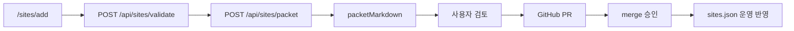

# 사이트 추가 구현 계획

## 데이터 흐름



1. 사용자가 사이트명·URL·카테고리·수집 방식·활성·메모·URL 테스트 여부 입력
2. 서버가 레포 `sites.json`을 읽어 중복·형식 검증
3. 선택 시 URL HEAD/GET probe (`probeUrlReachable`)
4. 검증 통과 시 PR 패킷 생성 (운영 파일 미변경)
5. 사용자가 브랜치·PR 생성 → merge 승인

## sites.json 반영 방식

- **런타임:** `buildSitesPatch()`로 미리보기만 생성
- **반영:** PR에서 `sites.json` 배열 끝에 1건 추가 (또는 패킷 JSON 스니펫 붙여넣기)
- **금지:** Vercel API가 운영 브랜치 `sites.json`을 직접 commit/push 하지 않음

### `html_table` / `html_card` selector 메모

`monitor.py`의 `fetch_html_generic()`은 기본적으로 `selectors.row` 안의 링크를
절대 URL로 바꿔 수집합니다. 목록 링크가 `javascript:`, `#`, 또는 목록 URL과 같은
비상세 링크라면 다음 합성 규칙을 함께 넣어야 합니다.

```json
{
  "type": "html_table",
  "selectors": {
    "row": "table tbody tr",
    "link": "a.detail",
    "link_template": "/board/view?id={0}",
    "link_arg_re": "goView\\('(\\d+)'\\)"
  }
}
```

- `link_template`: 추출한 그룹값으로 상세 URL을 만들고 `site.url` 기준으로 보정
- `link_id_attr`: `data-id`처럼 anchor 속성에 ID가 있을 때 사용
- `link_arg_re`: `onclick` 또는 `href` 안의 ID를 정규식 그룹으로 추출할 때 사용
- 합성 규칙이 없는 비상세 링크는 기존 동작처럼 skip

자세한 수집기 계약과 운영 점검은 `docs/MONITOR_ENGINEERING_RUNBOOK.md`를 기준으로 확인합니다.

## 검증 로직 (`web/lib/site-validation.ts`)

| 검증 | 처리 |
|------|------|
| 사이트명 필수 | error |
| URL 필수·http(s)·URL 파싱 | error |
| 공백 제거 | `normalizeUrl` |
| 중복 URL | error |
| 중복 사이트명 | warning |
| 수집 방식 | `COLLECTOR_TYPES` 화이트리스트 |
| collector 존재 | `checks.collectorRegistered` |
| date_unknown 위험 | api=낮음, 전용 html=중간, html_table=높음 |
| stable_id | 안내 문자열 |
| URL 접근 | optional probe |

## PR 생성 방식

### 1차 (구현됨)

- `buildSiteAddPacket()` → 마크다운
- 제목 초안: `feat(sites): add {id} — {name}`
- 본문: URL, type, dry-run 체크리스트
- 로컬: `WORKS/SITE_ADD_PR_PACKET.md` 기록

### 2차 (NEEDS_USER)

환경변수 (Vercel Project Settings only):

- `GITHUB_TOKEN` — repo contents + pull_requests
- `GITHUB_REPO` — 기본 `pds2225/mail`

흐름: create branch → commit `sites.json` → `gh pr create --draft`  
**자동 merge 금지**, 토큰 값 로그 출력 금지.

## 수집 누락 방지 연결

사이트 추가 UI의 「수집 누락 점검」에 표시:

- collector 등록 여부
- URL 접근 테스트 결과
- date_unknown 위험도
- dry-run 가능 여부
- stable_id 안내

운영 검증: `python3 scripts/monitor_dry_run.py --skip-coverage-fetch`

## 남은 위험

| 위험 | 완화 |
|------|------|
| 잘못된 selector로 수집 0건 | PR 전 `monitor_dry_run` coverage |
| PR 없이 패킷만 생성하고 방치 | WORKS 문서 + 승인 체크리스트 |
| Vercel에서 FS 쓰기 실패 | 응답 본문 복사 버튼 |
| 토큰 유출 | env only, never log |
