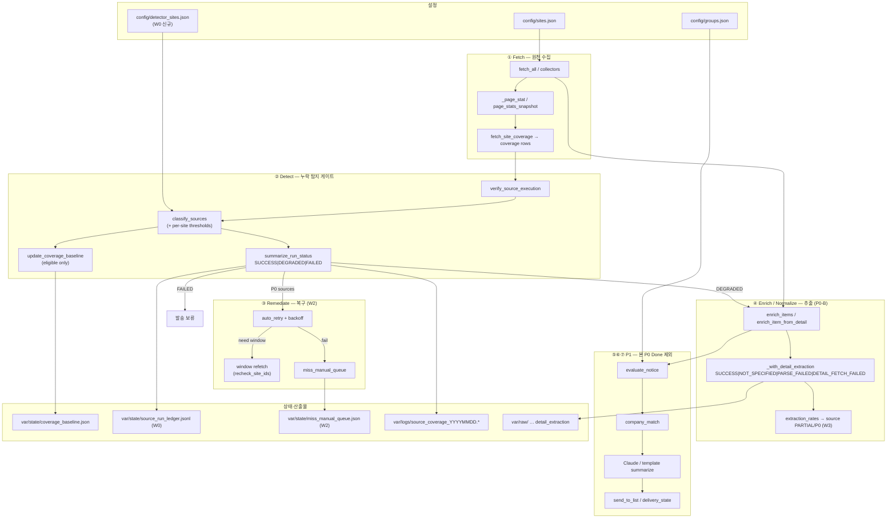
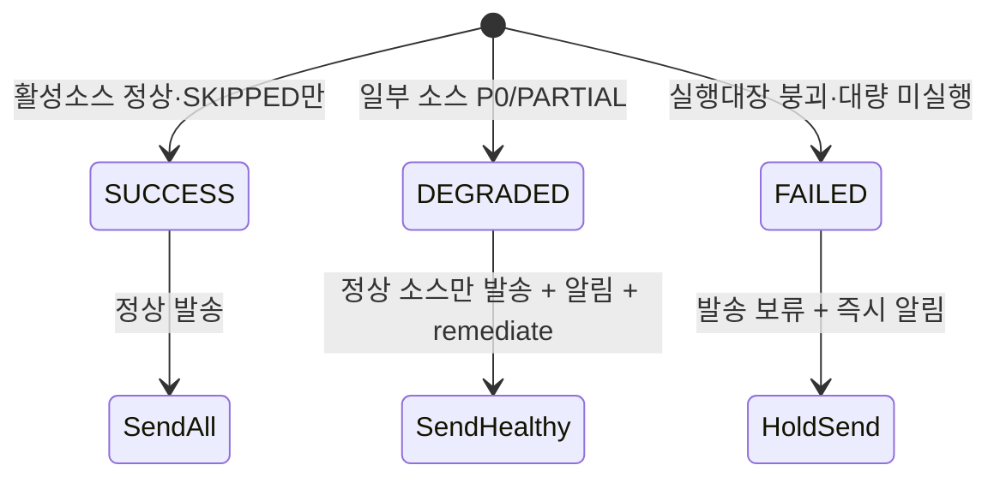

# 공고 누락 탐지 체계 — 보완 개발계획서

| 항목 | 내용 |
|------|------|
| 문서 ID | `PRD-NOTICE-MISS-DETECT-v3.1` |
| 작성일 | 2026-07-25 |
| 상태 | Draft (문서 산출 + 검토 반영 + 비개발자 설명) |
| 근거 | 누락 4단계 분석 + `coverage_alert`/`detail_extraction` As-Is + 개발안 검토 |
| 범위 원칙 | **P0 = 수집·추출 탐지·최소 복구**. 판정·기업·Claude는 **P1** |
| 읽는 법 | **운영·기획** → §0~§0-B · **개발** → §2 이후 |

---

## 0. 한 줄 결론

핵심은 기능 신설이 아니라 **이미 있는 탐지 코어에 사이트 정책·런 FAILED·재시도/수동큐를 붙여 복구 루프를 닫는 것**이다.  
P0 Done은 **W0+W1+W2**로 자르고, W3는 P0-B, W4~W5는 P0-C(관측/운영)로 분리한다.

---

## 0-B. 비개발자용 설명 (운영·기획)

이 절만 읽어도 “무엇을, 왜, 어느 순서로” 하는지 파악할 수 있다. 코드·파일명은 참고용이며 **몰라도 된다**.

### 이 시스템이 하는 일 (한 문장)

정부·기관 사이트에 올라온 **지원사업 공고를 자동으로 모아 메일로 보내 주는 서비스**인데, 그중 **「공고가 있는데도 우리 쪽에 안 들어온 경우」를 빨리 발견하고 다시 가져오려는 안전장치**를 만드는 일이다.

### 왜 필요한가

지금은 “프로그램이 에러 없이 끝났다”와 “공고를 빠짐없이 모았다”가 구분되지 않을 수 있다.

| 현장 상황 (예시) | 위험 |
|------------------|------|
| 사이트는 열리는데 점검·로그인 화면만 나옴 | 0건인데 “성공”으로 넘어감 |
| 평소 30건 나오던 곳에서 오늘 2건만 수집 | 조용히 대부분 누락 |
| 목록 1페이지만 읽고 끝냄 | 뒤 페이지 공고 전부 누락 |
| 상세 페이지를 못 읽어 지역·마감이 비어 있음 | “원문에 없음”인지 “읽기 실패”인지 모름 → 잘못 걸러질 수 있음 |

**이용자 입장 피해:** 신청 가능한 공고를 메일로 못 받음 → 기회 손실·신뢰 하락.

### “누락”이 생기는 네 구간 (쉬운 비유)

택배·서류 업무에 비유하면 이해하기 쉽다.

| 구간 | 쉬운 말 | 지금 우선순위 |
|------|---------|----------------|
| ① 가져오기 | 사이트에서 공고 **목록**을 제대로 긁어왔는가 | **최우선 (P0)** |
| ② 내용 읽기 | 각 공고 **상세**(마감·지역·대상)를 제대로 읽었는가 | **바로 다음 (P0)** |
| ③ 골라내기 | 우리 그룹·기업에 **맞는 공고인지** 판단 | 나중 (P1) |
| ④ 보내기 | 요약·메일에 **빠지지 않고** 실렸는가 | 나중 (P1) |

비유: ①은 “창고에서 상자 가져오기”, ②는 “상자 안 라벨 읽기”, ③은 “우리 매장에 넣을지 고르기”, ④는 “손님에게 배달”.  
**상자를 안 가져왔는데 배달만 예쁘게 만들면 소용없다** → 그래서 ①·②를 먼저 한다.

### 전체 흐름 (비개발자용)

```text
[매일 자동 실행]
   │
   ├─ ① 등록된 사이트들에서 공고 목록 수집
   ├─ ② “평소보다 적게 왔나? 사이트 빠졌나? 이상 화면인가?” 점검
   │      ├─ 대부분 정상 → 메일 발송 진행
   │      ├─ 일부만 이상 → 정상 사이트 공고는 보내고, 이상 사이트는 재시도·알림
   │      └─ 전체가 크게 깨짐 → 메일 발송을 잠시 멈춤 (잘못된 발송 방지)
   ├─ ③ 상세 내용 읽기 (실패해도 공고 자체를 함부로 버리지 않음)
   └─ ④ (이후 과제) 적합성 판단 · 기업 추천 · AI 요약 · 메일 구성
```

### 신호가 울리면 무슨 뜻인가

| 표시 | 쉬운 말 | 메일 | 운영자가 할 일 |
|------|---------|------|----------------|
| 정상 (SUCCESS) | 오늘 수집 문제 없음 | 평소대로 발송 | 없음 |
| 주의 (DEGRADED) | **일부** 사이트만 이상 | **정상 사이트분은 발송** | 알림 확인 → 자동 재시도 결과 보기 → 안 되면 확인 대기열 처리 |
| 중단 (FAILED) | 수집 체계가 **크게** 깨짐 | **발송 보류** | 즉시 원인 확인 (다수 사이트 미실행 등) |

“P0” = **지금 당장 손봐야 하는 수집 사고** 신호.  
“P1” = 중요하지만, **추천이 조금 틀리거나 요약이 아쉬운 수준** — 수집 사고와 같은 급으로 묶지 않는다.

### “0건”이 나와도 무조건 사고는 아님

| 경우 | 해석 |
|------|------|
| 평소에도 거의 안 나오는 지역·월간 사이트 | 오늘 0건일 수 있음 → 경고만 또는 며칠 지켜봄 |
| 평소 매일 수십 건이던 대형 포털이 0건 | **사고 가능성 큼** → 최우선 알림 |
| 사이트를 새로 켠 직후 | 비교할 “평소 수치”가 없음 → 바로 최고 경고하지 않음 |

그래서 **사이트마다 민감도를 다르게** 둔다 (큰 포털은 엄격, 작은·드문 사이트는 느슨).

### “정보가 비어 있음”의 세 가지 의미

운영·메일 화면에서 “지역 없음”이 보일 때, 아래를 구분해야 한다.

| 의미 | 쉬운 말 | 대처 |
|------|---------|------|
| 원문에 원래 없음 | 전국 대상·상시모집처럼 **안 적힌 것이 정상** | 정상으로 두고 진행 가능 |
| 읽기 실패 | 원문에는 있을 수 있는데 **우리가 못 뽑음** | 재시도·검수 유지 (함부로 “해당 없음” 처리 금지) |
| 상세 페이지 접속 실패 | 링크는 있는데 **페이지를 못 열음** | 재시도·확인 대기열 |

### 개발을 나눠 하는 이유 (일정·기대 효과)

한 번에 “수집+추천+AI 요약”을 하면 **무엇이 고장 났는지** 모르고, 완료도 흐려진다.

| 단계 | 끝나면 생기는 효과 (비개발자) |
|------|-------------------------------|
| **1차 완료 (W0~W2)** | “어느 사이트가 이상한지” 알림 + 자동 한두 번 다시 시도 + 사람이 확인할 목록 |
| **2차 (상세 읽기)** | “못 읽은 공고”와 “원래 빈 공고”가 구분됨 → 잘못된 제외 감소 |
| **나중 (추천·AI)** | 맞는 공고만 더 잘 골라 주고, 요약 실패로 공고가 사라지지 않게 함 |

### 운영자가 앞으로 보게 될 것 (목표)

1. **실행 요약:** 오늘 전체 정상 / 일부 주의 / 발송 보류  
2. **이상 사이트 목록:** 평소 N건 → 오늘 M건, 이유(접속 실패·급감·이상한 화면 등)  
3. **확인 대기열:** 자동 재시도로도 안 된 건 → `확인함` / `오경보` / `수정완료` 표시  
4. (2차 이후) **상세 읽기 실패 비율**이 높은 사이트

### 자주 묻는 질문

**Q. 일부 사이트만 고장인데 메일 전체가 멈춤?**  
A. 아니요. **일부만 이상(주의)** 이면 정상 사이트 공고는 보냅니다. **전체가 크게 깨질 때만** 발송을 잠시 멈춥니다.

**Q. AI 요약이 안 되면 공고를 안 보내나?**  
A. 이번 최우선 과제(P0)의 범위가 아닙니다. 나중 과제에서 **요약 실패여도 기본 양식으로 보내도록** 합니다.

**Q. “추천이 많아지면” 누락이 준 것 아닌가?**  
A. 추천을 느슨하게 하면 안 빠지는 대신 **안 맞는 공고가 늘어** 피로도가 커집니다. 누락 방지(수집)와 추천 품질은 **따로** 관리합니다.

**Q. 완료됐다는 건 무엇을 말하나?**  
A. 1차 완료 = **이상 탐지 + 자동 재시도 + 사람 확인 목록**이 실제로 동작하고, 자동 검사(테스트)를 통과한 상태.  
“수집 재현율 98%” 같은 숫자는 **운영해 보며 나중에** 목표로 올립니다.

### 용어 미니 사전

| 용어 | 쉬운 말 |
|------|---------|
| 소스 / 사이트 | 공고를 가져오는 기관 웹사이트·API 하나 |
| 기준선 (baseline) | 그 사이트의 **평소 수집 건수** (최근 정상 실행 기준) |
| 급감 | 평소보다 갑자기 훨씬 적게 수집됨 |
| 실행대장 | 오늘 **어떤 사이트를 돌렸는지** 적어 둔 점검표 |
| 수동(확인) 큐 | 자동으로 안 고쳐져 **사람이 볼 목록** |
| P0 / P1 | 긴급도. P0=수집 사고, P1=추천·요약 등 다음 과제 |

→ 기술 상세(아키텍처·함수·상수)는 **§3~§4** 참고.

---

## 1. 문제 정의

| 구분 | 발생 지점 | 우선순위 |
|------|-----------|----------|
| 원천 수집 누락 | 접속·목록·페이지네이션 | **P0-A** (W0~W2) |
| 정보 추출 누락 | 상세보강·필드 의미 | **P0-B** (W3) |
| 판정 누락 | 그룹·기업 | **P1** |
| 전달 누락 | 요약·메일 | **P1** |

> 프로그램이 오류 없이 종료된 것과 공고를 빠짐없이 수집한 것은 다르다.

---

## 2. 개발안 검토 반영 (v3 변경점)

| # | 검토 의견 | 계획 반영 |
|---|-----------|-----------|
| 1 | P0 Done에 W2~W5 일괄 포함 → 범위 재비대 | **P0-Done = W0+W1+W2만**. W3=P0-B, W4~W5=P0-C |
| 2 | `notice_lifecycle.jsonl`은 초기 필수 아님 | W4 **후순위**. 당분간 `source_coverage`+`detail_extraction`+raw_store |
| 3 | `confirmed_healthy`·장기 30평균은 W0 금지 | §7 강화는 **W2 이후 옵션**. W0는 기존 SUCCESS 필터 계약 테스트 고정 |
| 4 | `region_unknown` 삭제는 과다 | Done에서 **삭제 금지**. 1차는 **매핑 테이블**만 |
| 5 | 런 FAILED 기준 모호 | ADR에 수치 고정: `exec_ok==false` **또는** `missing/active ≥ 0.30`(또는 missing≥5) |
| 6 | KPI 98%/95%를 초기 Done에 쓰지 말 것 | Done = **pytest 계약**. 수치 KPI는 운영 관측 후 ratchet |

### As-Is 갭 요약

| Wave | 상태 | 핵심 갭 |
|------|------|---------|
| W0 | PARTIAL | ADR·detector·런 FAILED·ledger 없음 (`OK`/`DEGRADED`만) |
| W1 | PARTIAL | `thresholds=` 있음, 사이트 설정·monitor 주입·분기 테스트 없음 |
| W2 | MISSING | `recheck_site_ids` 계산만, retry/queue 없음 |
| W3 | PARTIAL | 필드 3상태 있음, 추출률→소스 게이트 없음 |
| W4~W5 | MISSING | lifecycle·ack UI 없음 |

---

## 3. 전체 아키텍처

### 3.1 파이프라인 (런타임)



### 3.2 발송 매트릭스 (소스 P0 ≠ 런 중단)



| Run 상태 | 조건(ADR 고정) | 발송 |
|----------|----------------|------|
| `SUCCESS` (alias: 기존 `OK`) | P0=0 이고 `exec_ok` | 전체 |
| `DEGRADED` | P0≥1 이고 FAILED 조건 아님 | 정상 소스만 |
| `FAILED` | `exec_ok==false` **또는** `missing_count/active_expected ≥ 0.30` **또는** `missing_count ≥ 5` | **보류** |

### 3.3 모듈 배치 (어디를 고치나)

| 계층 | 경로 | 역할 |
|------|------|------|
| 설정 | `config/sites.json`, `config/detector_sites.json` | 활성 소스·탐지 정책 |
| 탐지 순수로직 | `mail_core/operations/coverage_alert.py` | classify/verify/summarize/baseline |
| 복구 (신규) | `mail_core/operations/miss_remediation.py` | retry·queue·ack |
| 레저 (신규) | `mail_core/operations/source_run_ledger.py` | JSONL append |
| 오케스트레이션 | `monitor.py` (훅 최소) | fetch→audit→enrich→(P1)→send |
| 테스트 | `tests/test_coverage_p0.py` 등 | 계약 |

**보호:** `monitor.py` 대량 수정 금지. 로직은 `mail_core/`, monitor는 호출 1~수 줄.

---

## 4. 단계별 함수 · 로직 · 정의값

범례: ✅ 기존 / 🔧 확장 / 🆕 신규 / ⏸ P1(스키마만)

---

### Stage 0 — 설정 로드

| 구분 | 내용 |
|------|------|
| **함수** | ✅ `load_sites()` · ✅ `load_groups()` · ✅ `load_settings()` · 🆕 `load_detector_config(path) → {defaults, sites}` · 🆕 `thresholds_for_site(cfg, site_id) → dict` |
| **로직** | `defaults` ← `detector_sites.defaults` ← 사이트 오버라이드 merge. 없는 site_id는 defaults만. |
| **정의값** | 파일: `config/detector_sites.json`. 키: `zero_item_policy`, `drop_threshold`(급감 비율=1−잔존비), `drop_ratio_p0`(코드 잔존비, 기본 0.2), `minimum_baseline`, `baseline_min_runs`, `expected_frequency`, `auto_retry`, `retry_backoff_sec`, `ignore_env_tls` |

`zero_item_policy` 값:

| 값 | 0건 동작 |
|----|----------|
| `p0_if_baseline` | 기준선 충분·median≥1 → P0 (기본) |
| `warning` | P1만 |
| `ignore_zero` | 사유 미부여 (남용 금지) |

---

### Stage 1 — Fetch (원천 수집)

| 구분 | 내용 |
|------|------|
| **함수** | ✅ collectors (`fetch_bizinfo`, `fetch_html_generic`, …) · ✅ `_page_stat` / `page_stats_snapshot` / `reset_page_stats` · ✅ `fetch_site_coverage` · ✅ `stable_id` |
| **로직** | enabled 소스만 실행 → items + coverage row. page_stat에 `stop_reason`/`duplicate_page` 기록. 실패해도 다른 소스 계속. |
| **정의값** | `stop_reason`: `SINGLE_PAGE` \| `EMPTY_PAGE` \| `MAX_PAGES_HIT`. 킬스위치 `MONITOR_NO_PAGE_STATS=1`. coverage row 핵심 필드: `site_id`, `enabled`, `collector_fn`, `fetch_success`, `fetch_error`, `item_count`, `date_unknown_count`, `detail_link_ok_count`, `valid_record_count`, `suspicious_content_count` |

**소스 상태 enum (Fetch 판정 결과, Stage 2에서 부여):**

```
SUCCESS | PARTIAL | FAILED | SKIPPED | ZERO_SUSPICIOUS
```

상수: `COLLECT_STATUS_*` (`coverage_alert.py`)

---

### Stage 2 — Detect (누락 게이트)

| 구분 | 내용 |
|------|------|
| **함수** | ✅ `baseline_stats` · ✅ `classify_source_status` · ✅ `classify_sources` · ✅ `verify_source_execution` · ✅ `summarize_run_status` 🔧 · ✅ `grade_for` · ✅ `build_coverage_payload` · ✅ `detect_coverage_anomalies`(레거시 알림, 게이트와 분리) · 🆕 `append_source_run_ledger` |
| **배선** | ✅ `run_source_coverage_audit` 🔧 (`thresholds=` / detector 주입, FAILED 시 send-hold 플래그) |

**로직 (classify_source_status 요약):**

1. disabled → `SKIPPED`
2. unknown collector / 미실행 → `FAILED` + `SOURCE_NOT_EXECUTED` (P0)
3. `!fetch_success` → `FETCH_FAILED` 또는 `_PARSER_ERROR_HINTS`면 `PARSER_FAILED` (P0)
4. item_count==0 → 기준선 충분이면 `ZERO_ITEMS_WITH_BASELINE`(P0), 아니면 `BASELINE_INSUFFICIENT`(P1); policy=`warning`이면 P1로 강등
5. valid_record_rate < 0.8 → `SCHEMA_VALIDATION_FAILED` (P0)
6. suspicious_content_rate ≥ 0.5 → `CONTENT_VALIDATION_FAILED` (P0)
7. count/median < drop_ratio_p0 → `COLLECTION_DROP_HIGH` (P0); soft band는 P1
8. duplicate_page → `DUPLICATE_PAGE_LOOP` (P0); MAX_PAGES_HIT → `PAGINATION_INCOMPLETE` (P1)
9. 날짜·상세링크 비율 저하 → P1 사유
10. 사유 있으면 `PARTIAL`, 없으면 `SUCCESS`

**정의값 (DEFAULT_THRESHOLDS / 상수):**

| 상수 | 값 | 의미 |
|------|-----|------|
| `BASELINE_WINDOW_RUNS` | 7 | 최근 정상 N회 |
| `BASELINE_MIN_RUNS` | 3 | 미만이면 기준선 부족 |
| `DROP_RATIO_P0` | 0.2 | 잔존 &lt;20% → P0 급감 |
| `DROP_RATIO_P1` | 0.5 | 잔존 &lt;50% → soft P1 |
| `DATE_PARSE_MIN_RATE` | 0.5 | 게시일 파싱률 |
| `DATE_PARSE_DROP_PP` | 0.3 | 대비 하락 p.p. |
| `DETAIL_LINK_MIN_RATE` | 0.5 | 상세링크 비율 |
| `VALID_RECORD_MIN_RATE` | 0.8 | 스키마 정상 비율 |
| `SUSPICIOUS_CONTENT_MAX_RATE` | 0.5 | 로그인/캡차/점검 |
| `SPIKE_RATIO_P1` | 3.0 | 급증 배수 |
| `SPIKE_ABSOLUTE_EXCESS` | 20 | 급증 절대건수 |
| `RUN_FAILED_MISSING_RATIO` 🆕 | 0.30 | 런 FAILED |
| `RUN_FAILED_MISSING_ABS` 🆕 | 5 | 런 FAILED |

**사유코드:**

- P0: `SOURCE_NOT_EXECUTED`, `FETCH_FAILED`, `PARSER_FAILED`, `ZERO_ITEMS_WITH_BASELINE`, `COLLECTION_DROP_HIGH`, `DUPLICATE_PAGE_LOOP`, `CONTENT_VALIDATION_FAILED`, `SCHEMA_VALIDATION_FAILED`
- P1: `DATE_PARSE_RATE_LOW`, `PAGINATION_INCOMPLETE`, `DETAIL_LINK_RATE_LOW`, `BASELINE_INSUFFICIENT`, `COLLECTION_SPIKE_HIGH`

**baseline 로직 (`update_coverage_baseline`):**  
`fetch_success`이고 anomaly/pollution 아닌 날만 append. window 기본 14.  
W0에서 계약 테스트로 고정: classify상 SUCCESS가 아니면 ledger의 `baseline_eligible=false`.  
`confirmed_healthy`·장기 30평균은 **W2 이후 옵션** (W0 금지).

---

### Stage 3 — Remediate (복구) — W2, P0-Done 포함

| 구분 | 내용 |
|------|------|
| **함수** | 🆕 `plan_retries(p0_sources, detector_cfg)` · 🆕 `retry_fetch_source(site, attempt)` · 🆕 `enqueue_manual(queue, entry)` · 🆕 `ack_manual(queue, id, resolution)` · 🆕 `refetch_window(site_id, since_date)` · 🔧 `recheck_site_ids` 소비 |
| **로직** | P0(FETCH/PARSER/CONTENT) → `auto_retry`회 backoff → 성공 시 risk 해제·알림 resolved / 실패 시 manual_queue. 급감·0건은 window refetch 후보. 일일 사이트당 retry 상한. |
| **정의값** | `auto_retry` 기본 2, `retry_backoff_sec` `[60,180]`, queue resolution: `ack`\|`false_alarm`\|`fixed`. 파일: `var/state/miss_manual_queue.json` |

---

### Stage 4 — Enrich / Normalize (정보 추출) — P0-B / W3

| 구분 | 내용 |
|------|------|
| **함수** | ✅ `enrich_items` · ✅ `enrich_item_from_detail` · ✅ `_parse_detail_from_page` · ✅ `_with_detail_extraction` · ✅ `_persist_detail_extraction_meta` · 🆕 `compute_extraction_rates(items) → {absolute_ok, decision_ok, parse_failed_rate, detail_fetch_failed_rate}` · 🆕 `map_region_surface(field_status) → digest label` (unknown **매핑**, 삭제 아님) |
| **로직** | 상세 GET 실패 → 전 필드 `DETAIL_FETCH_FAILED`. 본문 있음·값 없음 → 성공 런이면 `NOT_SPECIFIED`, 아니면 `PARSE_FAILED`. 실패 공고는 **제외 금지·review 유지**. W3에서 소스 단위 추출률을 classify에 연결. |
| **정의값** | `EXTRACTION_SUCCESS="SUCCESS"`, `NOT_SPECIFIED`, `PARSE_FAILED`, `DETAIL_FETCH_FAILED`. `_DETAIL_FAILURE_STATUSES`. `MAX_DETAIL_ENRICH`, `DETAIL_ENRICH_WORKERS=10` |

**필수필드 계층:**

| 계층 | 항목 | 실패 시 |
|------|------|---------|
| 절대 | 공고명, 기관(또는 소스), URL | 스키마 P0 |
| 판정 | 접수상태/상시, 대상 힌트, 지역 또는 `NOT_SPECIFIED` | review, 자동제외 금지 |
| 선택 | 금액, 신청방법, 세부일정 | 모니터링만 |

**region_unknown 매핑 (삭제 금지):**

| detail field status | surface |
|---------------------|---------|
| `NOT_SPECIFIED` | region 미지정(원문) |
| `PARSE_FAILED` / `DETAIL_FETCH_FAILED` | region 미상(추출실패) → 기존 `region_unknown` 버킷과 매핑 가능 |

---

### Stage 5 — Evaluate / Company / Summarize / Delivery — P1 (Done 제외)

| 단계 | 함수 (기존) | P0 취급 |
|------|-------------|--------|
| Evaluate | `evaluate_notice`, `classify_region_for_group` | ⏸ 스키마 예약만 |
| Company | `company_match.compute_match_score` 등 | ⏸ |
| Summarize | Claude 경로 / 템플릿 | 실패해도 공고 제외 금지 (P1-C) |
| Delivery | `send_to_list`, `delivery_state` | 런 FAILED면 보류 플래그만 P0 |

---

### Stage 6 — 산출물·관측

| 구분 | 내용 |
|------|------|
| **함수** | ✅ `write_source_coverage_json/md` · ✅ `write_p0_collection_alert` · ✅ `render_*` · 🆕 ledger writer · (W5) queue MD/UI |
| **경로** | `var/state/coverage_baseline.json`, `source_run_ledger.jsonl`, `miss_manual_queue.json`, `var/logs/source_coverage_YYYYMMDD.*`, `var/raw/` |

**source_run JSONL 1행 스키마 (W0):**

```json
{
  "run_id": "20260725T090000Z",
  "site_id": "nipa",
  "status": "PARTIAL",
  "risk_level": "P0",
  "reason_codes": ["COLLECTION_DROP_HIGH"],
  "item_count": 4,
  "baseline_median": 24,
  "page_stat": {"stop_reason": "MAX_PAGES_HIT"},
  "extraction_rates": null,
  "retry": {"attempt": 0, "max": 2},
  "baseline_eligible": false
}
```

---

## 5. 우선순위 · WBS (재분할)

| Wave | 범위 | Done 증거 | 티어 |
|------|------|-----------|------|
| **W0** | ADR(enum+FAILED 수치), detector 초안, ledger 스키마/헬퍼, `OK→SUCCESS` alias, summarize FAILED | 단위테스트 + 파일 존재 | **P0-Done** |
| **W1** | 사이트 threshold 주입, A=P0/B=warning 테스트, monitor audit 배선 | `test_coverage_p0` 분기 green | **P0-Done** |
| **W2** | retry·manual_queue·recheck 소비, 상한 | 큐 생성/해제 테스트 | **P0-Done** |
| **W3** | 추출률→소스 리포트, 필수계층, region 매핑 | detail+rate 테스트 | **P0-B** |
| **W4** | notice_lifecycle (선택) | 샘플 산출 | **P0-C 후순위** |
| **W5** | 수동큐 ack UI 또는 MD 런북 | runbook 절 | **P0-C** |
| **W6+** | Evaluate… 스키마 / 판정·기업·Claude | 별도 PRD | **P1** |

### P0-Done 게이트 (W0+W1+W2만)

1. `pytest tests/test_coverage_p0.py` (+ W0/W1/W2 신규) green  
2. 동일 0건 → 사이트 A=P0, B=warning 분기  
3. P0 시 manual_queue(또는 동등) enqueue  
4. 재시도 성공 시 risk 해제 경로  
5. Run `SUCCESS`/`DEGRADED`/`FAILED` + FAILED 시 발송 보류 플래그  
6. baseline에 실패/P0일 미반영 회귀 유지  
7. **P1 코드 변경 없음** / **`region_unknown` 삭제 없음** / **lifecycle 필수 아님**

수치 KPI(98% 등)는 초기 Done에 넣지 않는다.

---

## 6. 예상 문제 (요약)

E01~E20은 v2와 동일 기조. v3에서 강조:

- **E12** lifecycle 폭증 → W4 후순위로 완화  
- **E09** FAILED 수치 ADR 고정으로 완화  
- **E13** P0-Done=W0~W2로 범위 재비대 방지  

전문 표는 부록 A.

---

## 7. KPI (관측용, Done 아님)

| KPI | 목표(운영 가정) | 비고 |
|-----|-----------------|------|
| 활성 소스 실행률 | 100% | 하드에 가깝게 감시 |
| 오경보율 | ≤15% | false_alarm / 알림 |
| 수집 재현율 등 | ≥98% 등 | **2주 관측 후 ratchet** |

---

## 8. Out of Scope

- DB/DDL (JSON Schema)
- Claude·기업승격·키워드 대량 확장
- `region_unknown` 경로 삭제
- W0에서의 confirmed_healthy / 장기 30평균
- monitor/streamlit 대규모 리팩터

---

## 9. 다음 실행 프롬프트

> W0 착수: (1) 상태 enum ADR — Run FAILED 수치 `missing_ratio≥0.30` 또는 `missing≥5` 포함, `OK`≡`SUCCESS` alias (2) `source_run` JSONL 스키마 + `mail_core` 쓰기 헬퍼 (3) `config/detector_sites.json` 초안 (4) `summarize_run_status` FAILED 분기 + 단위테스트.  
> P1·lifecycle·confirmed_healthy·region_unknown 삭제·monitor 대량수정 금지.

---

## 부록 A. 예상 문제 E01~E20

| ID | 문제 | 해결 |
|----|------|------|
| E01 | HTTP200 위장 실패 | suspicious_content P0 |
| E02 | 첫 페이지만 | page_stat / MAX_PAGES |
| E03 | 급감 미탐지 | baseline + drop_ratio |
| E04 | 진성 0건 오경보 | baseline·zero_item_policy |
| E05 | baseline 오염 | SUCCESS만 반영 |
| E06 | 동일 임계 오경보 | detector_sites |
| E07 | 미기재/파싱 혼동 | 3상태 + 매핑 |
| E08 | 필수 과다 | 필드 계층 |
| E09 | 발송 논쟁 | SUCCESS/DEGRADED/FAILED |
| E10 | 탐지 후 미복구 | W2 remediation |
| E11 | retry 폭풍 | 횟수·backoff·일일 상한 |
| E12 | 로그 폭증 | W4 후순위·요약만 |
| E13 | P0 범위 혼입 | Done=W0~W2 |
| E14 | 키워드 FP | P1 |
| E15 | 승격 남발 | P1 |
| E16 | 이중 판정 | 게이트=classify만 |
| E17 | ENV TLS 오경보 | ENV_TLS / ignore_env_tls |
| E18 | 보호파일 | mail_core 중심 |
| E19 | 허위 DONE | pytest 게이트 |
| E20 | recall 게이트 혼동 | 문서 분리 |

---

## 부록 B. 함수 치트시트 (파일별)

### `mail_core/operations/coverage_alert.py` ✅

`load/save_coverage_baseline`, `baseline_stats`, `detect_coverage_anomalies`, `update_coverage_baseline`, `classify_source_status`, `classify_sources`, `verify_source_execution`, `summarize_run_status`, `grade_for`, `build_coverage_payload`, `describe_*`, `render_*`

### `monitor.py` ✅ (훅만 확장)

`fetch_site_coverage`, `run_source_coverage_audit`, `write_source_coverage_*`, `write_p0_collection_alert`, `_page_stat`, `enrich_items`, `enrich_item_from_detail`, `_with_detail_extraction`, `execute_monitor`, (`evaluate_notice` 이하 P1)

### 신규 예정 `mail_core/operations/`

| 모듈 | 함수 |
|------|------|
| `detector_config.py` | `load_detector_config`, `thresholds_for_site` |
| `source_run_ledger.py` | `append_source_run`, `iter_runs` |
| `miss_remediation.py` | `plan_retries`, `retry_fetch_source`, `enqueue_manual`, `ack_manual`, `refetch_window` |

---

## 변경 이력

| 버전 | 일자 | 내용 |
|------|------|------|
| v1 | (선행) | P0/P1 분리 초안 |
| v2 | 2026-07-25 | As-Is·E01~E20·Done·W0 |
| v3 | 2026-07-25 | 검토 반영(P0-Done=W0~W2, W4 후순위, FAILED 수치, region 매핑), **전체 아키텍처 + 단계별 함수/로직/정의값** |
| v3.1 | 2026-07-25 | **§0-B 비개발자용 설명** (왜/네 구간/신호/0건/FAQ/용어) + 읽는 법 안내 |
