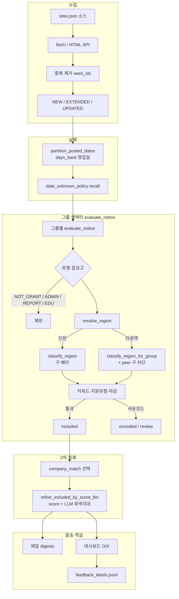

# 필터·셀렉터 파이프라인

> 수집 후 그룹 매칭·지역 판정·O/X 검수까지의 정본. PR #229 (`cursor/filter-selector-fixes-c61a`) 기준.

## O/X UI (메일 발송 없음)

Streamlit 탭 **검수·O/X** → 섹션 **제목 O/X (메일 발송 없음)**

| 항목 | 내용 |
|------|------|
| 동작 | 제목만 보고 **O 맞음** / **X 아님** |
| 저장 | `data/golden/feedback_labels.jsonl` (메일 미발송) |
| 큐 | `data/golden/ox_title_queue.json` · `scripts/build_ox_title_queue.py` |
| 화면 | 왼쪽 제목 · 오른쪽 O/X · 카운터 `대기 N / 전체 큐 · 누적 라벨` |
| 실행 | `python3 -m streamlit run streamlit_app.py --server.headless true` → `:8501` |

## 지역 이중경로 정리

| 문제 | 조치 |
|------|------|
| `classify_region` vs `for_group` 호출이 흩어짐 | 단일 진입점 `resolve_region()` |
| 인천만 구(부평구) 배타, for_group은 통과 | for_group에 **동일 광역 타 구 차단** 이식 |
| `use_generic_region` 이름 불명확 | `uses_incheon_region_engine()` |

의도적 분기:

- **인천**(남동구 기본): `classify_region` — 구 단위 정밀도
- **타 시·도**: `classify_region_for_group` — 임의 광역/시·군

정책(타 구 전용 차단)은 양쪽 동일. 진입점만 `resolve_region`으로 모음.

## 전체 구조



핵심 게이트는 CSS 셀렉터가 아니라 **`evaluate_notice` → `resolve_region` → (선택) 점수/LLM**.

## 점수 공식 (2차 컷)

```
score = priority×30 + or×5 + (or≥3 → +15) + region×20
      + region_mismatch×(-25) + exclude×(-50)  # clamp 0–100
```

LLM은 기본 밴드(예: 40–70)에서만. AI 그룹 `score_threshold: 1`이면 점수 게이트는 거의 no-op.

## 컨설턴트 신청·모집 (워치리스트)

그룹 메일은 **기업이 신청하는 지원금 공고**용이다. 제목이 `컨설턴트 모집`이어도 `evaluate_notice`가 재정 신호 없는 컨설팅으로 보면 `CONSULTING_ONLY`로 제외한다.

전국 대상 활성 그룹을 하나 더 넣으면 `tests/test_decision_matrix.py`가 `ACTIVE` 전 그룹에 지역 배타를 걸어 깨진다. 컨설턴트 신청 공고는 그룹이 아니라 **워치리스트**로 보낸다.

| 항목 | 내용 |
|------|------|
| 전달 | `config/watchlist.json` `keywords` — 제목·주관기관만 매칭, 본문 무시 |
| 수집 | 기존 소스 + 정부24 `gov24_consultant`·`gov24_mgmt_consultant` (`ul.list li`, 전문가 소스와 동일) |
| 0건 | locgovNews `컨설턴트`/`경영지도사` 검색은 비는 날이 많다. detector는 `warning` |
| 키워드 | `컨설턴트 모집`·`컨설턴트 신청` 등 구(句). 단독 `컨설턴트`는 결과발표·우수사례 오탐 |
| 구 키워드 | IP나래 등은 `_keywords_보존`. `keywords`를 비우면 🎯 발송이 멈춘다 |
| 회귀 | `tests/test_consultant_notices.py` · PR #251 |

## 관련 파일

| 경로 | 역할 |
|------|------|
| `monitor.py` | `evaluate_notice`, `resolve_region`, 날짜·발송 |
| `mail_core/matching/scoring.py` | `score_and_filter` |
| `mail_core/delivery/feedback.py` | O/X 로컬 라벨 |
| `streamlit_app.py` | 검수·O/X 탭 |
| `tests/test_filter_selector_fixes.py` | 셀렉터·지역 회귀 |
| `tests/test_consultant_notices.py` | 컨설턴트 신청 소스·워치리스트 |
| `docs/wiki/ox-title-review.md` | O/X UI 상세 |

## 관련 링크

- PR: https://github.com/pds2225/mail/pull/229 · 컨설턴트 신청 수집 https://github.com/pds2225/mail/pull/251
- [[ox-title-review]] · [[region-resolve]]
